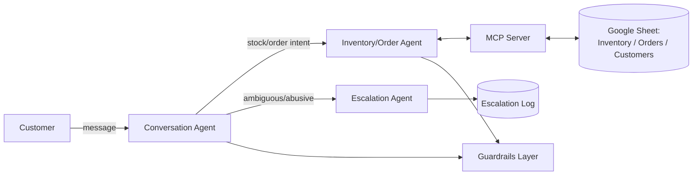
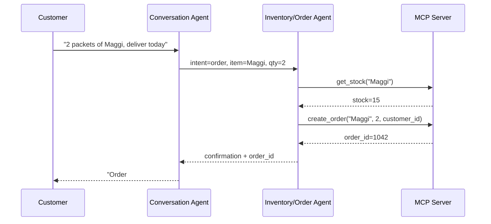

# System Design — DukaanMitra

## High-Level Architecture

## Agent Responsibilities
| Agent | Responsibility | Tools used |
|---|---|---|
| Conversation Agent | Intent routing, top-level reply | none (delegates to others) |
| Inventory/Order Agent | Real stock/price/order actions | MCP tools |
| Escalation Agent | Handle edge cases, log handoffs | `log_escalation` |

## Key Sequence: Customer Places an Order

## Guardrails Placement
Guardrails wrap both the Conversation Agent's input (sanitize/detect injection attempts) and the Inventory/Order Agent's output (verify any number against an actual tool result before it's spoken to the customer). Full detail in `SECURITY.md`.

## Escalation Trigger Logic
An interaction is escalated to the human owner when any of the following is true:
- The intent classifier's confidence score is below threshold
- Abusive or harassing language is detected
- The customer explicitly asks for a refund or to speak to a person
